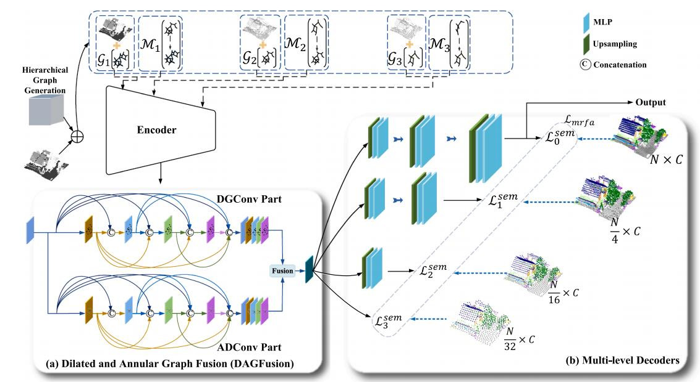

# RFFS-Net
Code for "[Beyond single receptive field: A receptive field fusion-and-stratification network for airborne laser scanning point cloud classification](https://www.sciencedirect.com/science/article/pii/S0924271622000922?via%3Dihub)" in ISPRS Journal of Photogrammetry and Remote Sensing (ISPRS Journal Ph &amp; RS).


<p align="middle">
  
</p>

## Overview
You can train or test RFFS-Net on ISPRS Vaihingen 3D, LASDU, and DFC2019 (US3D) dataset.

## Dependencies
- Python 3.6
- PyTorch 1.7
- cuda 11

## Datasets
- ISPRS Vaihingen 3D
- LSADU 
- DFC2019 (US3D)

## Usage
- **Stage1** *Install pointnet2-ops*

  Install pointnet2-ops.

  ```
  cd pointnet2_ops_lib
  python setup.py install
  ```

- **Stage2** *Train*

  Train our RFFS-Net.

  ```
  cd tools
  python train.py
  ```

- **Stage3** *Test*

  Test our RFFS-Net.
  ```
  cd tools
  python test.py
  ```

## References
This repo is built based on [PointConv_PyTorch](https://github.com/DylanWusee/pointconv_pytorch). Thanks for their great work!

### BibTeX

If you find our work and this repository useful. Please consider giving a star :star: and citation &#x1F4DA;.

```bibtex
@article{mao2022beyond,
  title={Beyond single receptive field: A receptive field fusion-and-stratification network for airborne laser scanning point cloud classification},
  author={Mao, Yongqiang and Chen, Kaiqiang and Diao, Wenhui and Sun, Xian and Lu, Xiaonan and Fu, Kun and Weinmann, Martin},
  journal={ISPRS Journal of Photogrammetry and Remote Sensing},
  volume={188},
  pages={45--61},
  year={2022},
  publisher={Elsevier}
}
```
